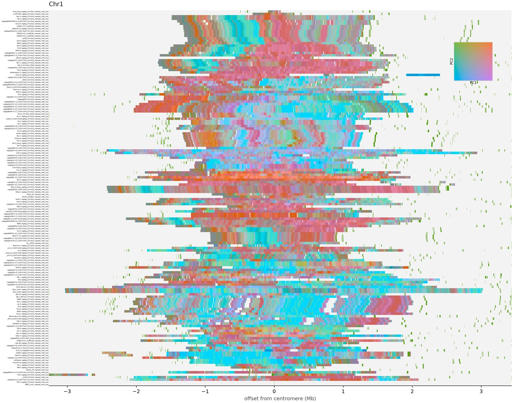

# arrayscape

Draw tandem-repeat arrays across many genomes: annotate every assembly, cut
the monomers out, colour them with [chromomer](https://github.com/mbeavitt/chromomer),
and draw one figure per chromosome with the assemblies stacked as rows.



*Chromosome 1 of 155 A. thaliana pangenome assemblies: 12.3 million CEN178
monomers, each row one assembly, centred on its own centromere, coloured by
5-mer composition.*

The embedding is fitted once over every monomer from every genome, which is the
whole point — a colour then means the same thing in every row and every
chromosome, so a block of shared colour is a real statement about shared
composition rather than an artefact of each assembly being scaled on its own.

## Install

Needs `chromomer`, GNU `parallel`, and whichever annotator you use:

```
pip install git+https://github.com/mbeavitt/chromomer
```

- **TRASH** route (default): `trash-py` on PATH.
- **FasTAN** route: `FAtoGDB`, `FasTAN`, `ANOtoBED`, `GDBshow` and `samtools`.

## Use

```
arrayscape -o out *.fasta                       # TRASH
arrayscape -o out --annotator fastan *.fasta    # FasTAN
```

Or start part-way in, if the slow stage is already done:

```
arrayscape -o out --from-annotations *_repeats_with_seq.csv   # after trash-py
arrayscape -o out --annotator fastan --from-annotations *.1ano
arrayscape -o out --from-monomers *.monomers.fasta
```

Output:

```
out/
  monomers/<genome>.fasta   per-genome monomers
  monomers.fasta            everything, concatenated
  chromosomes.txt           the identifier report
  colours.tsv               the chromomer table
  plots/<chrom>.png         one figure per chromosome
  logs/                     per-genome annotator and coordinate logs
```

## Rephasing

An annotator picks where a repeat unit starts, and it picks per array. FasTAN
chooses a partition phase per array from its own seed, so two arrays of the same
satellite come out cut at different points in the repeat. The sequence is the
same; its k-mer composition is not, and because the shift is constant across
every monomer of an array it does not average out — the whole array moves in
composition space.

On 155 *A. thaliana* assemblies, 73% of the variance along the leading component
sat *between* centromeres rather than within them for that annotator, against
16% for one that phases consistently. Comparing arrays or genomes without
rephasing largely compares phase choices.

So by default every array is rotated onto a common reference monomer, forwards
or reverse complemented, whichever matches better. That settles orientation at
the same time, which matters more than it sounds: two annotators run on the same
assembly can emit monomers on opposite strands, and their mean 5-mer profiles
then agree to a cosine of only 0.28. After rephasing, 0.99995.

`--no-rephase` turns it off, for monomers you know are already phased.

## Chromosome identifiers

Before anything is plotted the run reports how many unique chromosome
identifiers it found and how many genomes each appears in, and warns about:

- identifiers present in fewer than half the genomes — usually unplaced
  scaffolds, or one assembly naming things differently;
- identifiers differing only in case or punctuation (`Chr1` vs `chr1`);
- headers that did not parse at all.

None of these stop the run. They matter because each variant becomes its own
band of rows in the figure, which is easy to miss and easy to misread.

## Options

```
Draw tandem-repeat arrays across many genomes: annotate, cut monomers,
colour them with chromomer, plot one figure per chromosome.

  arrayscape -o out *.fasta                      # TRASH, the default
  arrayscape -o out --annotator fastan *.fasta   # FasTAN
  arrayscape -o out --from-monomers *.monomers.fasta

Every genome is independent until the colouring, so each stage is one GNU
parallel fan-out. The embedding is fitted once over every monomer from every
genome, which is the point: a colour then means the same thing in each row.

  -o DIR              output directory (default out)
  -j N                parallel jobs (default: nproc)
  --annotator NAME    trash (default) or fastan
  --class NAME        one exact TRASH class; default is every class of --period,
                      because TRASH's class suffix is a per-run index and the
                      same array is 178_1 in one assembly and 178_2 in the next
  --period N          repeat period for FasTAN, and the monomer length (default 178)
  --tol F             fractional length tolerance on a monomer (default 0.15)
  --from-annotations  inputs are existing TRASH *_repeats_with_seq.csv or FasTAN *.1ano
  --from-monomers     inputs are already monomer fastas named <genome>.*
  --bins N            horizontal resolution of a row (default 3000)
  --smooth N          rolling mean over N columns (default 9)
  --no-align          plot absolute position instead of offset from centromere
  --no-rephase        skip putting every array in one rotational frame. Only do
                      this if you know your monomers are already phased: an
                      annotator picks the cut point per array, and that choice
                      otherwise dominates the composition it is measured by
  --keep-temp         keep the per-genome working files
```

## Licence

MIT.
